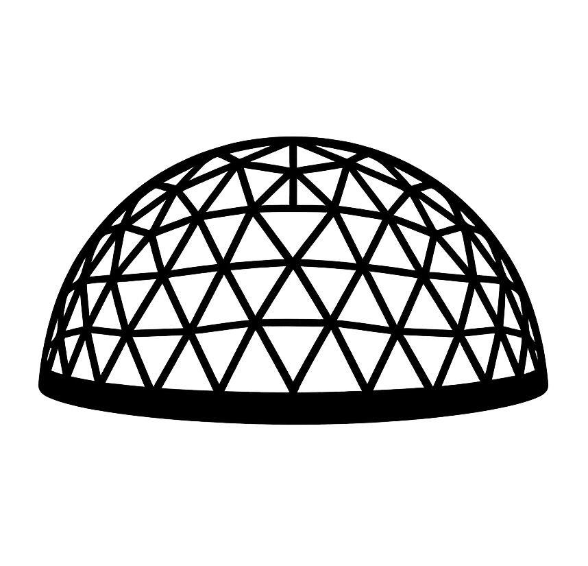
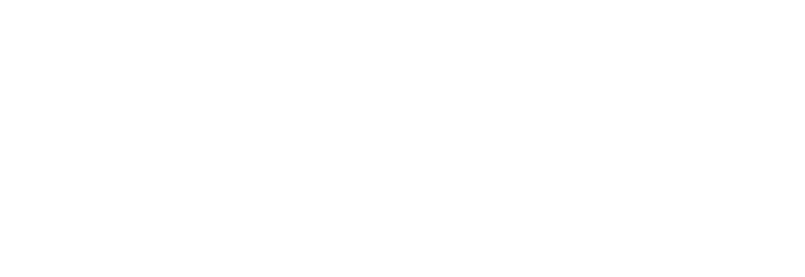
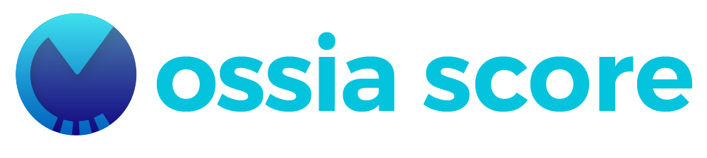

  
  
  

    
    
     
    
    
  

Domeport Pro is a standalone fulldome content visualizer for dome and planetarium environments. Load DomeMaster or equirectangular content (video files, live streams, or real-time sources) and preview it instantly in a 3D dome projection.

## Features

- 📡 Live input via NDI, Spout and Syphon
- 🎬 Video file playback
- 📷 Domemaster and equirectangular format
- 👁️ Multiple dome models

## Credits

Developed by the [Société des Arts Technologiques](https://sat.qc.ca), built on [ossia score](https://ossia.io).

Fulldome test pattern by [Paul Bourke](https://paulbourke.net/dome/testpattern/). The images may be freely used under the condition it is not modified in any way. The image may be freely distributed as long as this license statement is included.

  
  

